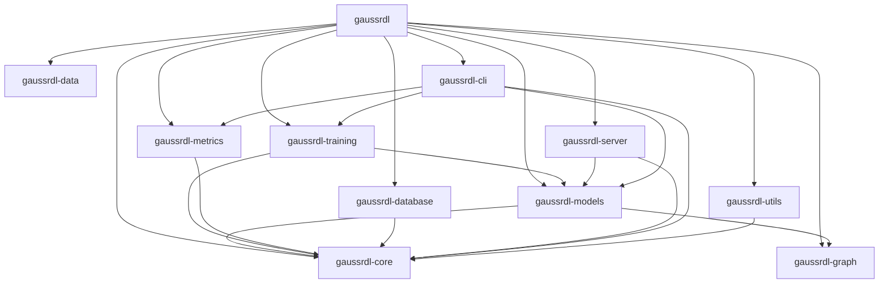

# GaussRDL Developer Guide

## Overview

This guide provides comprehensive information for developers contributing to GaussRDL, including the development environment setup, code structure, testing procedures, and contribution guidelines.

## Table of Contents

1. [Development Environment Setup](#development-environment-setup)
2. [Code Structure](#code-structure)
3. [Development Workflow](#development-workflow)
4. [Testing](#testing)
5. [Code Quality Standards](#code-quality-standards)
6. [Performance Guidelines](#performance-guidelines)
7. [Documentation Standards](#documentation-standards)
8. [Contributing Guidelines](#contributing-guidelines)
9. [Troubleshooting](#troubleshooting)

## Development Environment Setup

### Prerequisites

- **Rust**: 1.70 or later
- **Cargo**: Latest stable version
- **Git**: For version control
- **Python**: 3.8+ (for data preprocessing and visualization)
- **CUDA**: 11.8+ (optional, for GPU acceleration)

### Initial Setup

```bash
# Clone the repository
git clone https://github.com/your-org/gaussrdl.git
cd gaussrdl

# Install Rust toolchain
rustup default stable
rustup update

# Install development dependencies
cargo install cargo-tarpaulin cargo-audit cargo-outdated cargo-clippy
cargo install cargo-watch  # For development
cargo install cargo-expand # For macro debugging

# Verify installation
cargo --version
rustc --version
```

### IDE Setup

#### VS Code (Recommended)
```bash
# Install Rust extension
code --install-extension rust-lang.rust-analyzer
code --install-extension vadimcn.vscode-lldb
code --install-extension serayuzgur.crates
```

#### IntelliJ IDEA / CLion
- Install the Rust plugin
- Configure the Rust toolchain
- Enable cargo integration

### Environment Variables

```bash
# Add to your shell profile (.bashrc, .zshrc, etc.)
export RUST_BACKTRACE=1
export RUST_LOG=debug
export CARGO_INCREMENTAL=1
export RUSTFLAGS="-C target-cpu=native"
```

## Code Structure

### Workspace Organization

```
GaussRDL/
├── Cargo.toml                 # Workspace configuration
├── Cargo.lock                 # Dependency lock file
├── README.md                  # Main documentation
├── DEVELOPERGUIDE.md          # This file
├── USERGUIDE.md              # User documentation
├── TUTORIAL.md               # Tutorials
├── MODELS.md                 # Model documentation
├── WORKSPACE.md              # Workspace structure
├── CONTRIBUTING.md           # Contribution guidelines
├── LICENSE                   # MIT License
├── gaussrdl/                 # Main library crate
├── gaussrdl-core/            # Core types and traits
├── gaussrdl-data/            # Data loading and processing
├── gaussrdl-graph/           # Graph construction and algorithms
├── gaussrdl-models/          # ML models and neural networks
├── gaussrdl-training/        # Training infrastructure
├── gaussrdl-metrics/         # Evaluation and monitoring
├── gaussrdl-database/        # Database connectivity
├── gaussrdl-server/          # HTTP server and API
├── gaussrdl-cli/             # Command-line interface
├── gaussrdl-utils/           # Utility functions
├── examples/                 # Example applications
├── tests/                    # Integration tests
├── docs/                     # Additional documentation
└── patches/                  # Dependency patches
```

### Crate Dependencies



### Key Design Principles

1. **Modularity**: Each crate has a specific responsibility
2. **Type Safety**: Extensive use of Rust's type system
3. **Error Handling**: Comprehensive error types and handling
4. **Performance**: Optimized for speed and memory efficiency
5. **Extensibility**: Easy to add new models and features
6. **Documentation**: Comprehensive documentation for all public APIs

## Development Workflow

### Branch Strategy

```bash
# Main development branch
main                    # Production-ready code
develop                 # Integration branch
feature/feature-name    # Feature development
bugfix/bug-description  # Bug fixes
hotfix/urgent-fix       # Critical fixes
```

### Development Process

1. **Create Feature Branch**
   ```bash
   git checkout develop
   git pull origin develop
   git checkout -b feature/amazing-feature
   ```

2. **Make Changes**
   ```bash
   # Edit files
   # Run tests
   cargo test
   cargo check
   cargo clippy
   ```

3. **Commit Changes**
   ```bash
   git add .
   git commit -m "feat: add amazing feature

   - Implement new functionality
   - Add comprehensive tests
   - Update documentation
   
   Closes #123"
   ```

4. **Push and Create PR**
   ```bash
   git push origin feature/amazing-feature
   # Create pull request on GitHub
   ```

### Commit Message Format

Follow the [Conventional Commits](https://www.conventionalcommits.org/) specification:

```
<type>[optional scope]: <description>

[optional body]

[optional footer(s)]
```

Types:
- `feat`: New feature
- `fix`: Bug fix
- `docs`: Documentation changes
- `style`: Code style changes
- `refactor`: Code refactoring
- `test`: Adding or updating tests
- `chore`: Maintenance tasks

### Code Review Process

1. **Self-Review**: Review your own code before submitting
2. **Peer Review**: At least one other developer must review
3. **Automated Checks**: All CI checks must pass
4. **Documentation**: Update relevant documentation
5. **Testing**: Ensure comprehensive test coverage

## Testing

### Test Structure

```
tests/
├── unit/              # Unit tests
├── integration/       # Integration tests
├── performance/       # Performance benchmarks
└── fixtures/          # Test data and fixtures
```

### Running Tests

```bash
# Run all tests
cargo test

# Run specific crate tests
cargo test -p gaussrdl-core
cargo test -p gaussrdl-models

# Run with output
cargo test -- --nocapture

# Run specific test
cargo test test_name

# Run integration tests
cargo test --test integration_tests

# Run benchmarks
cargo bench
```

### Test Coverage

```bash
# Generate coverage report
cargo tarpaulin --out Html --output-dir coverage

# View coverage report
open coverage/tarpaulin-report.html
```

### Writing Tests

#### Unit Tests
```rust
#[cfg(test)]
mod tests {
    use super::*;

    #[test]
    fn test_function() {
        let input = "test";
        let expected = "expected";
        let result = function(input);
        assert_eq!(result, expected);
    }

    #[test]
    fn test_error_handling() {
        let result = function_with_error("invalid");
        assert!(result.is_err());
    }
}
```

#### Integration Tests
```rust
// tests/integration_test.rs
use gaussrdl::*;

#[test]
fn test_end_to_end_workflow() {
    // Test complete workflow
    let dataset = get_dataset("rel-amazon", true).unwrap();
    let task = get_task("rel-amazon", "user-churn", true).unwrap();
    let config = UnifiedModelConfig::rgcn(128, 5, 4);
    let model = create_model(config).unwrap();
    
    // Verify model creation
    assert!(model.parameter_count() > 0);
}
```

### Performance Testing

```bash
# Run performance benchmarks
cargo bench

# Profile specific functions
cargo install flamegraph
cargo flamegraph --bench performance_benchmark
```

## Code Quality Standards

### Compilation Requirements

- **Zero Errors**: All code must compile without errors
- **Minimal Warnings**: Keep warnings to a minimum
- **Documentation**: All public APIs must be documented
- **Tests**: Maintain high test coverage (>80%)

### Code Style

#### Rust Formatting
```bash
# Format code
cargo fmt

# Check formatting
cargo fmt -- --check
```

#### Clippy Lints
```bash
# Run clippy
cargo clippy

# Run clippy with all lints
cargo clippy -- -D warnings
```

#### Common Clippy Rules
```rust
// Prefer this
let x = if condition { a } else { b };

// Over this
let x = if condition { a } else { b };

// Prefer this
for item in items.iter() {
    // ...
}

// Over this
for i in 0..items.len() {
    let item = &items[i];
    // ...
}
```

### Error Handling

#### Use Result Types
```rust
// Good
pub fn process_data(input: &str) -> Result<ProcessedData, ProcessError> {
    if input.is_empty() {
        return Err(ProcessError::EmptyInput);
    }
    // Process data
    Ok(ProcessedData::new(input))
}

// Avoid
pub fn process_data(input: &str) -> ProcessedData {
    // This can panic
    ProcessedData::new(input)
}
```

#### Custom Error Types
```rust
#[derive(thiserror::Error, Debug)]
pub enum ProcessError {
    #[error("Input is empty")]
    EmptyInput,
    #[error("Invalid format: {0}")]
    InvalidFormat(String),
    #[error("IO error: {0}")]
    Io(#[from] std::io::Error),
}
```

### Memory Management

#### Avoid Unnecessary Allocations
```rust
// Good - reuse allocation
let mut buffer = Vec::with_capacity(1000);
for item in items {
    buffer.push(process(item));
}

// Avoid - new allocation each iteration
for item in items {
    let mut buffer = Vec::new();
    buffer.push(process(item));
}
```

#### Use Efficient Data Structures
```rust
// Good - use HashSet for lookups
use std::collections::HashSet;
let set: HashSet<_> = items.iter().collect();

// Avoid - use Vec for lookups
let vec: Vec<_> = items.iter().collect();
```

## Performance Guidelines

### Optimization Strategies

1. **Profile First**: Always profile before optimizing
2. **Measure Impact**: Quantify performance improvements
3. **Consider Trade-offs**: Balance performance vs. maintainability
4. **Use Appropriate Algorithms**: Choose algorithms based on data size

### Common Optimizations

#### Parallel Processing
```rust
use rayon::prelude::*;

// Parallel iteration
let results: Vec<_> = items.par_iter()
    .map(|item| process(item))
    .collect();
```

#### Memory Pools
```rust
use std::sync::Arc;
use parking_lot::Mutex;

#[derive(Clone)]
pub struct MemoryPool {
    pool: Arc<Mutex<Vec<Vec<f32>>>>,
}

impl MemoryPool {
    pub fn acquire(&self) -> Vec<f32> {
        self.pool.lock().pop().unwrap_or_default()
    }
    
    pub fn release(&self, buffer: Vec<f32>) {
        self.pool.lock().push(buffer);
    }
}
```

#### Efficient Tensor Operations
```rust
// Use in-place operations when possible
tensor.add_(&other_tensor)?;

// Avoid unnecessary clones
let result = tensor.matmul(&other_tensor)?;
```

### Benchmarking

```rust
#[cfg(test)]
mod benches {
    use super::*;
    use criterion::{black_box, criterion_group, criterion_main, Criterion};

    fn bench_function(c: &mut Criterion) {
        c.bench_function("function_name", |b| {
            b.iter(|| {
                let input = black_box("test_input");
                function(input)
            })
        });
    }

    criterion_group!(benches, bench_function);
    criterion_main!(benches);
}
```

## Documentation Standards

### Code Documentation

#### Function Documentation
```rust
/// Processes the input data and returns the result.
///
/// # Arguments
///
/// * `input` - The input data to process
/// * `config` - Configuration parameters
///
/// # Returns
///
/// Returns a `Result` containing the processed data or an error.
///
/// # Examples
///
/// ```
/// use gaussrdl::process_data;
///
/// let result = process_data("input", &config)?;
/// assert!(result.is_ok());
/// ```
///
/// # Errors
///
/// This function will return an error if:
/// - The input is empty
/// - The configuration is invalid
/// - Processing fails
pub fn process_data(input: &str, config: &Config) -> Result<ProcessedData, ProcessError> {
    // Implementation
}
```

#### Struct Documentation
```rust
/// Configuration for data processing.
///
/// This struct contains all the parameters needed to configure
/// the data processing pipeline.
#[derive(Debug, Clone, Serialize, Deserialize)]
pub struct Config {
    /// The maximum number of items to process
    pub max_items: usize,
    /// Whether to enable parallel processing
    pub parallel: bool,
    /// The timeout in seconds
    pub timeout: Duration,
}
```

### API Documentation

#### Module Documentation
```rust
//! Data processing module.
//!
//! This module provides functionality for processing various types of data
//! including text, numerical, and graph data.
//!
//! # Examples
//!
//! ```
//! use gaussrdl_data::process_text;
//!
//! let result = process_text("Hello, world!")?;
//! ```
```

### Documentation Generation

```bash
# Generate documentation
cargo doc

# Generate documentation with private items
cargo doc --document-private-items

# Open documentation
cargo doc --open
```

## Contributing Guidelines

### Before Contributing

1. **Check Issues**: Look for existing issues or discussions
2. **Discuss Changes**: Open an issue for significant changes
3. **Follow Standards**: Adhere to code quality standards
4. **Test Thoroughly**: Ensure all tests pass

### Pull Request Process

1. **Fork Repository**: Fork the repository to your account
2. **Create Branch**: Create a feature branch from `develop`
3. **Make Changes**: Implement your changes
4. **Add Tests**: Add tests for new functionality
5. **Update Documentation**: Update relevant documentation
6. **Run Checks**: Ensure all checks pass
7. **Submit PR**: Create a pull request

### PR Checklist

- [ ] Code compiles without errors
- [ ] All tests pass
- [ ] Code follows style guidelines
- [ ] Documentation is updated
- [ ] No unnecessary dependencies added
- [ ] Performance impact considered
- [ ] Security implications reviewed

### Review Process

1. **Automated Checks**: CI/CD pipeline runs checks
2. **Code Review**: At least one reviewer approves
3. **Testing**: All tests must pass
4. **Documentation**: Documentation is complete
5. **Merge**: PR is merged to `develop`

## Troubleshooting

### Common Issues

#### Compilation Errors

**Error**: `cannot find module`
```bash
# Solution: Check module declarations
cargo check
```

**Error**: `unused import`
```bash
# Solution: Remove unused imports or prefix with underscore
use crate::unused_module as _unused;
```

**Error**: `missing documentation`
```bash
# Solution: Add documentation or disable warning
#[allow(missing_docs)]
pub struct MyStruct;
```

#### Test Failures

**Error**: `test failed`
```bash
# Run specific test with output
cargo test test_name -- --nocapture

# Check test environment
cargo test --verbose
```

#### Performance Issues

**Issue**: Slow compilation
```bash
# Enable incremental compilation
export CARGO_INCREMENTAL=1

# Use release mode for testing
cargo test --release
```

**Issue**: High memory usage
```bash
# Profile memory usage
cargo install memory-profiler
cargo memory-profiler

# Check for memory leaks
cargo install cargo-valgrind
cargo valgrind
```

### Debugging Tools

#### Logging
```rust
use tracing::{info, warn, error, debug};

debug!("Processing item: {:?}", item);
info!("Completed processing");
warn!("Performance warning: slow operation");
error!("Failed to process: {}", error);
```

#### Profiling
```bash
# CPU profiling
cargo install flamegraph
cargo flamegraph

# Memory profiling
cargo install heim
cargo heim
```

#### Debugging Macros
```rust
#[cfg(debug_assertions)]
println!("Debug: {:?}", value);

dbg!(value); // Debug macro
```

### Getting Help

1. **Check Documentation**: Review relevant documentation
2. **Search Issues**: Look for similar issues on GitHub
3. **Ask Questions**: Use GitHub Discussions
4. **Join Community**: Participate in community channels

## Conclusion

This developer guide provides comprehensive information for contributing to GaussRDL. Follow these guidelines to ensure high-quality contributions and maintain the project's standards.

Remember:
- Always test your changes thoroughly
- Follow the established code style
- Document your code properly
- Consider performance implications
- Engage with the community

Happy coding! 🚀 