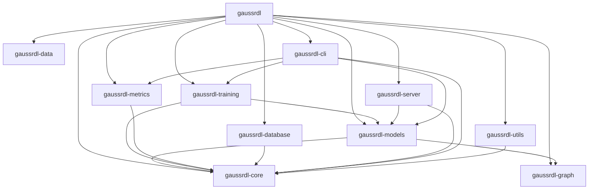

# GaussRDL Workspace Guide

## Overview

GaussRDL is organized as a modular Rust workspace with 11 specialized crates, each handling specific aspects of relational deep learning. This guide explains the workspace architecture, how to work with individual crates, and how to extend the system.

## Table of Contents

1. [Workspace Architecture](#workspace-architecture)
2. [Crate Overview](#crate-overview)
3. [Development Workflow](#development-workflow)
4. [Building and Testing](#building-and-testing)
5. [Adding New Features](#adding-new-features)
6. [Performance Considerations](#performance-considerations)
7. [Deployment](#deployment)

## Workspace Architecture

### Directory Structure

```
GaussRDL/
├── Cargo.toml                 # Workspace root configuration
├── Cargo.lock                 # Dependency lock file
├── README.md                  # Main documentation
├── DEVELOPERGUIDE.md          # Development guide
├── USERGUIDE.md              # User documentation
├── TUTORIAL.md               # Tutorials
├── MODELS.md                 # Model documentation
├── WORKSPACE.md              # This file
├── CONTRIBUTING.md           # Contribution guidelines
├── LICENSE                   # MIT License
├── gaussrdl/                 # Main library crate
│   ├── Cargo.toml
│   └── src/
│       ├── lib.rs            # Main library root
│       └── main.rs           # Main binary
├── gaussrdl-core/            # Core types and traits
│   ├── Cargo.toml
│   └── src/
│       ├── lib.rs            # Core library root
│       ├── error.rs          # Error handling
│       ├── types.rs          # Core types (Table, Database, etc.)
│       ├── traits.rs         # Base traits (Dataset, Task)
│       ├── base/             # Base implementations
│       └── core/             # Core functionality
├── gaussrdl-data/            # Data loading and processing
│   ├── Cargo.toml
│   └── src/
│       ├── lib.rs            # Data library root
│       ├── datasets/         # Dataset implementations
│       ├── tasks/            # Task implementations
│       ├── data/             # Data processing
│       ├── task/             # Task definitions
│       └── dataset/          # Dataset definitions
├── gaussrdl-graph/           # Graph construction and algorithms
│   ├── Cargo.toml
│   └── src/
│       ├── lib.rs            # Graph library root
│       ├── graph/            # Graph implementations
│       ├── algorithms/       # Graph algorithms
│       ├── sampling/         # Sampling strategies
│       ├── compression/      # Graph compression
│       ├── analysis/         # Graph analysis
│       ├── parallel/         # Parallel processing
│       ├── monitoring/       # Graph monitoring
│       └── visualization/    # Graph visualization
├── gaussrdl-models/          # ML models and neural networks
│   ├── Cargo.toml
│   └── src/
│       ├── lib.rs            # Models library root
│       ├── gnn_models/       # GNN model implementations
│       └── gt_model/         # Graph transformer models
├── gaussrdl-training/        # Training infrastructure
│   ├── Cargo.toml
│   └── src/
│       ├── lib.rs            # Training library root
│       └── training/         # Training implementations
├── gaussrdl-metrics/         # Evaluation and monitoring
│   ├── Cargo.toml
│   └── src/
│       ├── lib.rs            # Metrics library root
│       ├── metrics/          # Metrics implementations
│       └── monitoring/       # Monitoring implementations
├── gaussrdl-database/        # Database connectivity
│   ├── Cargo.toml
│   └── src/
│       ├── lib.rs            # Database library root
│       └── database/         # Database implementations
├── gaussrdl-server/          # HTTP server and API
│   ├── Cargo.toml
│   └── src/
│       ├── lib.rs            # Server library root
│       └── server/           # Server implementations
├── gaussrdl-cli/             # Command-line interface
│   ├── Cargo.toml
│   └── src/
│       ├── lib.rs            # CLI library root
│       └── cli/              # CLI implementations
├── gaussrdl-utils/           # Utility functions
│   ├── Cargo.toml
│   └── src/
│       ├── lib.rs            # Utils library root
│       ├── utils/            # Utility implementations
│       ├── memory/           # Memory management
│       ├── parallel/         # Parallel processing
│       ├── io/               # I/O operations
│       ├── gpu/              # GPU utilities
│       ├── distributed/      # Distributed computing
│       ├── testing/          # Testing utilities
│       └── di/               # Dependency injection
├── examples/                 # Example applications
│   ├── basic_usage.rs
│   ├── custom_model.rs
│   ├── dataset_loading.rs
│   ├── distributed_training.rs
│   ├── gat_example.rs
│   ├── lightrdl_example.rs
│   ├── memory_optimization.rs
│   ├── metrics_evaluation.rs
│   ├── parallel_processing.rs
│   ├── relgt_example.rs
│   ├── rgcn_example.rs
│   ├── stagegnn_example.rs
│   └── task_evaluation.rs
├── tests/                    # Integration tests
│   ├── test_datasets.rs
│   ├── test_integration.rs
│   └── test_tasks.rs
├── docs/                     # Additional documentation
│   ├── API_REFERENCE.md
│   ├── MODEL_ARCHITECTURE.md
│   └── REFACTORING_SUMMARY.md
└── patches/                  # Dependency patches
    └── candle-core-0.3.3/    # Custom Candle ML framework
```

### Dependency Graph



## Crate Overview

### Core Crates

#### `gaussrdl-core`
**Purpose**: Foundation types, traits, and base functionality

**Key Components**:
- `error.rs`: Comprehensive error handling with `thiserror`
- `types.rs`: Core types like `Table`, `Database`, `Result`
- `traits.rs`: Base traits like `Dataset`, `Task`, `Model`
- `base/`: Base implementations for common functionality
- `core/`: Core functionality and utilities

**Dependencies**: Minimal external dependencies
**Used by**: All other crates

#### `gaussrdl-data`
**Purpose**: Data loading, datasets, and data processing

**Key Components**:
- `datasets/`: Dataset implementations (Amazon, F1, H&M, etc.)
- `tasks/`: Task implementations (user-churn, link-prediction, etc.)
- `data/`: Data processing pipelines
- `task/`: Task definitions and interfaces
- `dataset/`: Dataset definitions and interfaces

**Dependencies**: `gaussrdl-core`
**Used by**: `gaussrdl`, `gaussrdl-training`, `gaussrdl-cli`

#### `gaussrdl-graph`
**Purpose**: Graph construction, manipulation, and algorithms

**Key Components**:
- `graph/`: Graph data structures and implementations
- `algorithms/`: Graph algorithms (centrality, clustering, etc.)
- `sampling/`: Sampling strategies (adaptive, layer-wise, cached)
- `compression/`: Graph compression techniques
- `analysis/`: Graph analysis tools
- `parallel/`: Parallel graph processing
- `monitoring/`: Graph monitoring and metrics
- `visualization/`: Graph visualization tools

**Dependencies**: `gaussrdl-core`
**Used by**: `gaussrdl-models`, `gaussrdl-training`

#### `gaussrdl-models`
**Purpose**: ML models and neural networks

**Key Components**:
- `gnn_models/`: GNN model implementations (RGCN, GAT, LightRDL, StageGNN)
- `gt_model/`: Graph transformer models (RelGT)
- `lib.rs`: Model factory and unified interfaces

**Dependencies**: `gaussrdl-core`, `gaussrdl-graph`, `candle-core`
**Used by**: `gaussrdl-training`, `gaussrdl-server`, `gaussrdl-cli`

### Infrastructure Crates

#### `gaussrdl-training`
**Purpose**: Training infrastructure and optimizers

**Key Components**:
- `training/`: Training implementations
- `config.rs`: Training configuration
- `distributed.rs`: Distributed training support

**Dependencies**: `gaussrdl-core`, `gaussrdl-models`
**Used by**: `gaussrdl-cli`

#### `gaussrdl-metrics`
**Purpose**: Evaluation metrics and monitoring

**Key Components**:
- `metrics/`: Metric implementations
- `monitoring/`: Monitoring and logging

**Dependencies**: `gaussrdl-core`
**Used by**: `gaussrdl-training`, `gaussrdl-cli`

#### `gaussrdl-database`
**Purpose**: Database connectivity and operations

**Key Components**:
- `database/`: Database implementations (PostgreSQL, SurrealDB)

**Dependencies**: `gaussrdl-core`
**Used by**: `gaussrdl-server`, `gaussrdl-cli`

### Interface Crates

#### `gaussrdl-server`
**Purpose**: HTTP server and REST API

**Key Components**:
- `server/`: Server implementations
- REST API endpoints
- WebSocket support
- Model serving

**Dependencies**: `gaussrdl-core`, `gaussrdl-models`
**Used by**: `gaussrdl`

#### `gaussrdl-cli`
**Purpose**: Command-line interface

**Key Components**:
- `cli/`: CLI implementations
- Command handlers
- Configuration management
- Monitoring tools

**Dependencies**: `gaussrdl-core`, `gaussrdl-models`, `gaussrdl-training`, `gaussrdl-metrics`
**Used by**: `gaussrdl`

#### `gaussrdl-utils`
**Purpose**: Utility functions and helpers

**Key Components**:
- `utils/`: General utilities
- `memory/`: Memory management
- `parallel/`: Parallel processing
- `io/`: I/O operations
- `gpu/`: GPU utilities
- `distributed/`: Distributed computing
- `testing/`: Testing utilities
- `di/`: Dependency injection

**Dependencies**: `gaussrdl-core`
**Used by**: All other crates

### Main Crate

#### `gaussrdl`
**Purpose**: Main library with unified API

**Key Components**:
- `lib.rs`: Re-exports from all other crates
- `main.rs`: Main binary entry point
- Unified API for all functionality

**Dependencies**: All other crates
**Used by**: End users

## Development Workflow

### Building the Workspace

```bash
# Build entire workspace
cargo build

# Build specific crate
cargo build -p gaussrdl-core
cargo build -p gaussrdl-models

# Build in release mode
cargo build --release

# Build with specific features
cargo build --features gpu
```

### Testing

```bash
# Test entire workspace
cargo test

# Test specific crate
cargo test -p gaussrdl-core
cargo test -p gaussrdl-models

# Test with output
cargo test -- --nocapture

# Run integration tests
cargo test --test integration_tests
```

### Code Quality

```bash
# Format code
cargo fmt

# Check for issues
cargo clippy

# Check with all lints
cargo clippy -- -D warnings

# Audit dependencies
cargo audit
```

### Documentation

```bash
# Generate documentation
cargo doc

# Generate documentation with private items
cargo doc --document-private-items

# Open documentation
cargo doc --open
```

## Adding New Features

### Adding a New Dataset

1. **Create dataset file**: `gaussrdl-data/src/datasets/my_dataset.rs`

```rust
use gaussrdl_core::{Dataset, DatasetConfig, Table, Result};
use std::path::Path;

pub struct MyDataset {
    name: String,
    // Add dataset-specific fields
}

impl Dataset for MyDataset {
    fn name(&self) -> &str {
        &self.name
    }
    
    fn load(&mut self, config: &DatasetConfig) -> Result<()> {
        // Implement data loading logic
        Ok(())
    }
    
    fn get_table(&self, split: &str) -> Result<Table> {
        // Return data for train/val/test split
        todo!()
    }
    
    // Implement other required methods...
}
```

2. **Register in module**: Add to `gaussrdl-data/src/datasets/mod.rs`

```rust
pub mod my_dataset;
pub use my_dataset::MyDataset;

// Add to get_dataset function
pub fn get_dataset(name: &str, download: bool) -> Result<Box<dyn Dataset>> {
    match name {
        "my-dataset" => Ok(Box::new(MyDataset::new())),
        // ... existing datasets
    }
}
```

### Adding a New Model

1. **Create model file**: `gaussrdl-models/src/gnn_models/my_model.rs`

```rust
use gaussrdl_core::{Result, Table};
use gaussrdl_models::{ModelTrait, ModelConfig};
use candle_core::{Device, Tensor};

pub struct MyModel {
    config: ModelConfig,
    device: Device,
    // Add model-specific fields
}

impl ModelTrait for MyModel {
    fn predict(&self, input: &Table) -> Result<Vec<f64>> {
        // Implement prediction logic
        Ok(vec![0.5; 10])
    }
    
    // Implement other required methods...
}
```

2. **Register in module**: Add to `gaussrdl-models/src/gnn_models/mod.rs`

```rust
pub mod my_model;
pub use my_model::MyModel;

// Add to model factory
pub fn create_model(config: UnifiedModelConfig) -> Result<Box<dyn ModelTrait>> {
    match config.model_type {
        ModelType::Custom("MyModel") => Ok(Box::new(MyModel::new(config)?)),
        // ... existing models
    }
}
```

### Adding a New Metric

1. **Create metric file**: `gaussrdl-metrics/src/metrics/my_metric.rs`

```rust
use gaussrdl_metrics::Metric;
use gaussrdl_core::Result;

pub struct MyMetric {
    name: String,
}

impl Metric for MyMetric {
    fn name(&self) -> &str {
        &self.name
    }
    
    fn compute(&self, predictions: &[f64], targets: &[f64]) -> Result<f64> {
        // Implement metric computation
        Ok(0.85)
    }
    
    fn higher_is_better(&self) -> bool {
        true
    }
}
```

2. **Register in module**: Add to `gaussrdl-metrics/src/metrics/mod.rs`

```rust
pub mod my_metric;
pub use my_metric::MyMetric;

// Add to metric registry
pub fn get_metric(name: &str) -> Option<Box<dyn Metric>> {
    match name {
        "my_metric" => Some(Box::new(MyMetric::new())),
        // ... existing metrics
    }
}
```

## Performance Considerations

### Memory Management

#### Efficient Data Structures
```rust
// Use efficient data structures
use std::collections::HashMap;
use parking_lot::RwLock;

// Pre-allocate vectors
let mut results = Vec::with_capacity(expected_size);

// Use memory pools for frequent allocations
let pool = MemoryPool::new(1000);
let buffer = pool.acquire();
// ... use buffer
pool.release(buffer);
```

#### GPU Memory Management
```rust
// Efficient GPU memory usage
let device = Device::Cuda(0);
let tensor = Tensor::zeros(&[batch_size, hidden_dim], DType::F32, &device)?;

// Use mixed precision for memory efficiency
let config = UnifiedModelConfig::default();
config.use_mixed_precision = true;
```

### Parallel Processing

#### Rayon Integration
```rust
use rayon::prelude::*;

// Parallel iteration
let results: Vec<_> = data.par_iter()
    .map(|item| process_item(item))
    .collect();

// Parallel graph processing
let processed_nodes: Vec<_> = graph.nodes().par_iter()
    .map(|node| process_node(node))
    .collect();
```

#### Async Processing
```rust
use tokio;

#[tokio::main]
async fn main() -> Result<()> {
    // Async data loading
    let dataset = load_dataset_async("rel-amazon").await?;
    
    // Async training
    let trainer = AsyncTrainer::new(config);
    let metrics = trainer.train_async(&model, &dataset, &task).await?;
    
    Ok(())
}
```

### Caching and Optimization

#### Model Caching
```rust
use std::sync::Arc;
use parking_lot::Mutex;

#[derive(Clone)]
struct ModelCache {
    models: Arc<Mutex<HashMap<String, Box<dyn ModelTrait>>>>,
}

impl ModelCache {
    pub fn get_or_load(&self, name: &str, path: &str) -> Result<Box<dyn ModelTrait>> {
        let mut models = self.models.lock();
        if let Some(model) = models.get(name) {
            Ok(model.clone())
        } else {
            let model = load_model(path)?;
            models.insert(name.to_string(), model.clone());
            Ok(model)
        }
    }
}
```

#### Graph Optimization
```rust
// Use efficient graph representations
let graph = Graph::new_optimized(&edges, &nodes)?;

// Enable graph compression
let compressed_graph = graph.compress(CompressionLevel::High)?;

// Use sparse matrix operations
let adjacency_matrix = graph.to_sparse_matrix()?;
```

## Deployment

### Production Build

```bash
# Optimized release build
cargo build --release

# Strip debug symbols
strip target/release/gaussrdl

# Create minimal binary
cargo build --release --bin gaussrdl
```

### Docker Deployment

```dockerfile
# Dockerfile
FROM rust:1.70 as builder
WORKDIR /app
COPY . .
RUN cargo build --release

FROM debian:bookworm-slim
RUN apt-get update && apt-get install -y ca-certificates
COPY --from=builder /app/target/release/gaussrdl /usr/local/bin/
EXPOSE 8080
CMD ["gaussrdl", "server", "--host", "0.0.0.0", "--port", "8080"]
```

### Kubernetes Deployment

```yaml
# k8s-deployment.yaml
apiVersion: apps/v1
kind: Deployment
metadata:
  name: gaussrdl
spec:
  replicas: 3
  selector:
    matchLabels:
      app: gaussrdl
  template:
    metadata:
      labels:
        app: gaussrdl
    spec:
      containers:
      - name: gaussrdl
        image: gaussrdl:latest
        ports:
        - containerPort: 8080
        resources:
          requests:
            memory: "1Gi"
            cpu: "500m"
          limits:
            memory: "4Gi"
            cpu: "2000m"
        env:
        - name: RUST_LOG
          value: "info"
        - name: GAUSSRDL_CACHE_DIR
          value: "/cache"
        volumeMounts:
        - name: cache
          mountPath: /cache
      volumes:
      - name: cache
        emptyDir: {}
```

### Monitoring and Logging

#### Structured Logging
```rust
use tracing::{info, warn, error, debug};

// Configure logging
tracing_subscriber::fmt()
    .with_env_filter("gaussrdl=info")
    .init();

// Use structured logging
info!(
    model = %model_name,
    dataset = %dataset_name,
    accuracy = %accuracy,
    "Training completed"
);
```

#### Metrics Collection
```rust
use prometheus::{Counter, Histogram, Registry};

// Define metrics
lazy_static! {
    static ref PREDICTION_COUNTER: Counter = Counter::new(
        "gaussrdl_predictions_total",
        "Total number of predictions"
    ).unwrap();
    
    static ref PREDICTION_DURATION: Histogram = Histogram::new(
        "gaussrdl_prediction_duration_seconds",
        "Prediction duration in seconds"
    ).unwrap();
}

// Record metrics
PREDICTION_COUNTER.inc();
let timer = PREDICTION_DURATION.start_timer();
// ... make prediction
timer.observe_duration();
```

## Conclusion

The GaussRDL workspace is designed for:

1. **Modularity**: Each crate has a specific responsibility
2. **Extensibility**: Easy to add new features and models
3. **Performance**: Optimized for speed and memory efficiency
4. **Maintainability**: Clean separation of concerns
5. **Scalability**: Support for distributed processing

### Best Practices

1. **Follow Rust conventions**: Use idiomatic Rust code
2. **Document everything**: Comprehensive documentation for all public APIs
3. **Test thoroughly**: Maintain high test coverage
4. **Optimize performance**: Profile and optimize critical paths
5. **Keep dependencies minimal**: Only add necessary dependencies
6. **Use type safety**: Leverage Rust's type system for safety

### Getting Help

- **Documentation**: Check crate-specific documentation
- **Examples**: Look at the examples directory
- **Tests**: Examine test files for usage patterns
- **Issues**: Check GitHub issues for common problems
- **Community**: Join discussions and ask questions

Happy development with GaussRDL! 🚀 